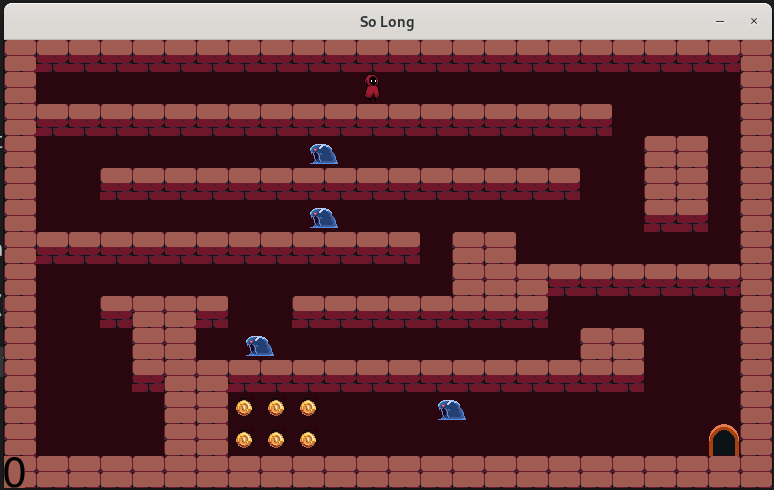

# Little Game
#### A simple 2D game built with [libft](https://github.com/aymane5554/mylib) (a c library that i made) and [mlx](https://github.com/42Paris/minilibx-linux.git) (c libray based on X11 library) , where players navigate through obstacles and try to score the highest.
## Installation

Follow these steps to get the project running locally:

1. Clone the repository:
   ```bash
   git clone https://github.com/aymane5554/little-game.git game
   ```

2. Navigate into the project directory:
   ```bash
   cd game
   ```

3. Install the required dependencies:
   ```bash
   make
   ```

4. Run the game:
   ```bash
   ./exe
   ```
   
## Usage

- Use the wasd keys to navigate the character.
Your goal is to collect all coins and enter the door!
## Screenshots


## Credits

- Game development framework: [mlx]
